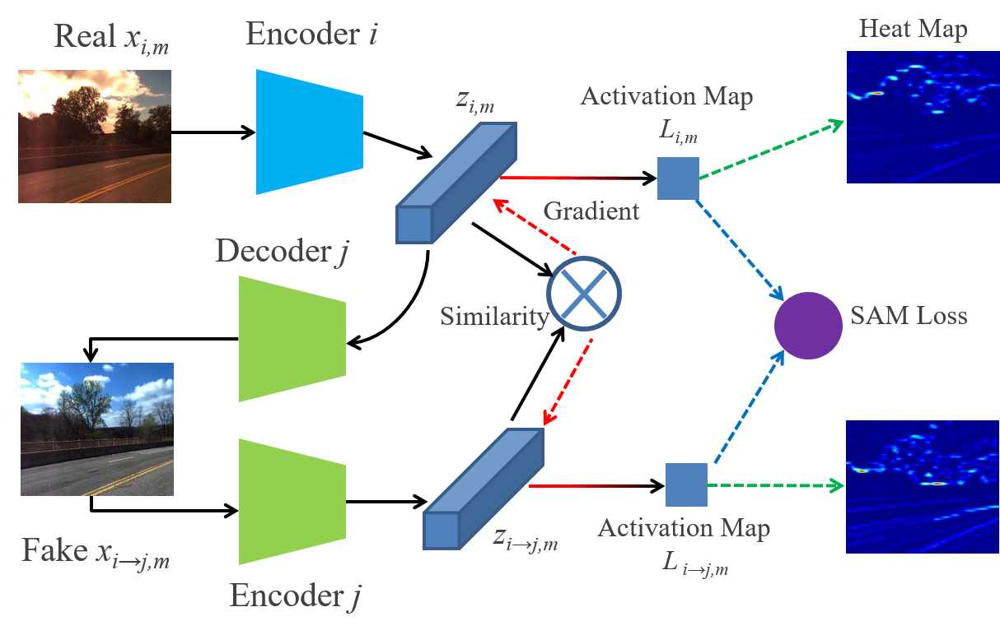

My research interests consist of visual perception, long-term localization, and domain adaptation.

My research goal is to develop robust algorithms that can be used on mobile robots or autonomous vehicles in a long-term perspective. I focus on reliable perception and localization algorithms under changing environments, e.g. illumination, seasonal and weather changes. The involved tasks are place recognition, depth prediction, semantic segmentation, etc. 

<!-- My research consists of visual perception, long-term localization, and multi-agent control.

My research goal is to develop intelligent and robust algorithms that can be used on mobile robots for the sake of challenges from both time and space. For outdoor mobile vehicles, I seek for reliable perception and localization algorithms under changing environments in a long-term perspective. From the spatial view, I also engage in the precise control of multiple agents for a stable autonomous system.    -->

## Visual Perception and Localization

* **Generative Vehicle Segmentation for Aerial-view Images**  [[available soon]()]   
To improve the performance of vehicle detection and segmentation in aerial-view images, we propose a novel algorithm based on the generative model. Inspired by multi-modal image translation, the vehicle patches could be regarded as the combination of vehicle content and multi-modal surrounding style distribution. Consequently, the process of vehicle segmentation is a content extraction and multi-to-single-modal image translation, which is suitable for domain adaptation. Based on this work, a GUI tool has been developed to help to obtain the ground truth for the [NeurlPS 2020 Challenge](http://challenge.interaction-dataset.com/prediction-challenge/intro).

* **Cross-Season Monocular Depth Prediction under Changing Environments**   [[available soon]()]   
<!--  -->
A new cross-season scaleless monocular depth prediction dataset is derived from CMU Visual Localization dataset through structure from motion. And then the several metrics are formulated to measure the performance on this dataset. Besides, we have benchmarked almost all the open-source state-of-the-art algorithms on KITTI dataset using the new dataset to find robust methods against the challenging environments. The paper and dataset will be available soon.

* **Domain Adaptation for Semantic and Geometric-aware Localization**   [[paper](https://arxiv.org/pdf/2010.00573.pdf)] [[code](https://github.com/HanjiangHu/DASGIL)]  
  
A novel multi-task architecture is proposed to fuse the geometric and semantic information into the multi-scale latent embedding representation for long-term visual localization. Also, domain adaptation is adopted from synthetic to real-world datasets to use the high-quality virtual ground truths without any human effort. The proposed method outperforms state-of-the-art baselines for retrieval-based localization under the challenging environment on the Extended CMU-Seasons dataset from the [visual localization benchmark](https://www.visuallocalization.net/benchmark/).

* **Domain-invariant Activation Map Learning for Long-term Localization**   [[paper 1](https://ieeexplore.ieee.org/document/8968047)] [[code 1](https://github.com/HanjiangHu/DIFL-FCL)] [[paper 2](https://arxiv.org/pdf/2009.07719.pdf)] [[code 2](https://github.com/HanjiangHu/DISAM)]

A self-supervised representation learning is proposed to extract domain-invariant features through multi-domain image translation by introducing feature consistency loss. Besides, a novel gradient-weighted similarity activation mapping loss (Grad-SAM) is incorporated for high-precision localization. In medium or high precision localization, our performance outperforms state-of-the-art image-based localization
baselines under the challenging environments with illumination variance, vegetation
and night-time images on CMU-Seasons and RobotCar-Seasons dataset from the [visual localization benchmark](https://www.visuallocalization.net/benchmark/).

<!-- ## Multi-robot control

* **Bearing-Only Adaptive Rendezvous Control of Networked Mobile Robots**   [[available soon]()]  

* **Cooperative Adaptive Cruise Control Based Non-Stop Intersection Passing**   [[paper](https://ieeexplore.ieee.org/abstract/document/9196991/)] 
In this papeI help to conduct ther, we resolve the CACC problem from the viewpoint ofI help to conduct the synchronization control, our main idea is to introdI help to conduct theuce the spatial-temporal synchronizatI help to conduct theion mechanism into vehicle platoon control to aI help to conduct thechieve the robust CACC and to further realize the I help to conduct thenon-stop intersection control. Firstly, by introduciI help to conduct theng the cross-coupling based space
synchronization mechanism, a distributed control algorithm is presented to achieve the single-lane CACC in the presence of vehicle-to-vehicle (V2V) communications, which enables autonomous vehicles to track the desired platoon trajectory while synchronizing their longitudinal velocities to keeping the expected inter-vehicle distance. Secondly, by designing the enter-time scheduling mechanism (temporal synchronization), a high-level intersection control strategy is proposed to command vehicles to form a virtual platoon to pass through the intersection without stopping. Thirdly, a Lyapunov-based timedomain stability analysis approach is presented. Compared with the traditional string stability based approach, the proposed approach guarantees the global asymptotical convergence of the proposed CACC system. Experiments in the small-scale simulated system demonstrate the effectiveness of the proposed
approach. -->

## Selected Undergraduate Project
* **Vision-based Intelligent Robotic Grasping System**   [[code](https://github.com/HanjiangHu/RGBD-eye-in-hand-robotics-grasping)] [[video](https://youtu.be/8ylxOqa1HiY)]  
  
The project aims to develop an intelligent and autonomous grasping system based on ROS for UR-5 Robot using an eye-in-hand RGBD camera. From the voice input (Mandarin), YOLO-based object detection and SegmenterLight-based segmentation are implemented to find the target point cloud. The 6-DoF pose of the object with respect to the camera is then estimated based on template matching through FPFH-based RANSAC and ICP algorithm. The project was awarded Third Prize of of ORBBEC 3-D Sensor Application Design Competition in 2018 International Conference on Optical and Photonic Engineering ([ICOPEN 2018](http://jsem.jp/jsem-bbs/img/375.pdf)).

<!-- * **Automobile Transmission Solenoid Valve Detection Device**   [[patent](https://worldwide.espacenet.com/patent/search/family/056043507/publication/CN105628368A?q=CN105628368A)]   -->

